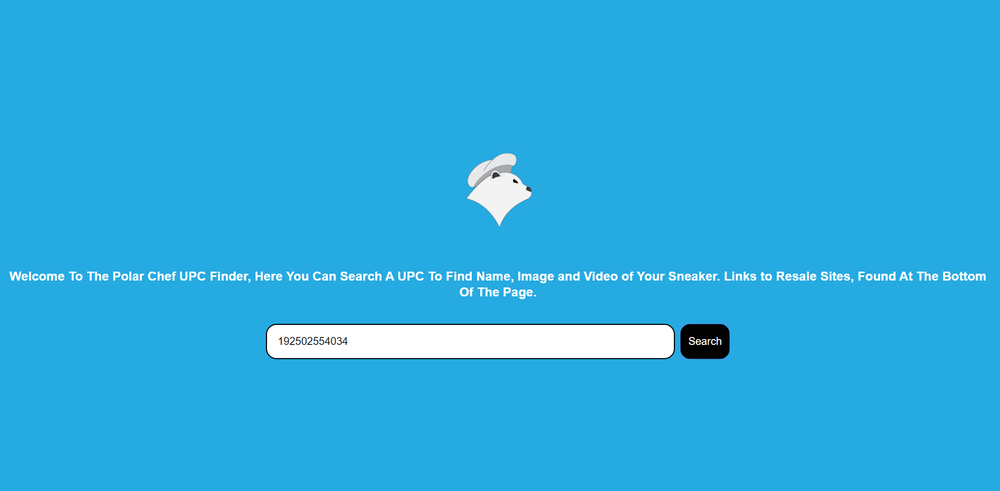
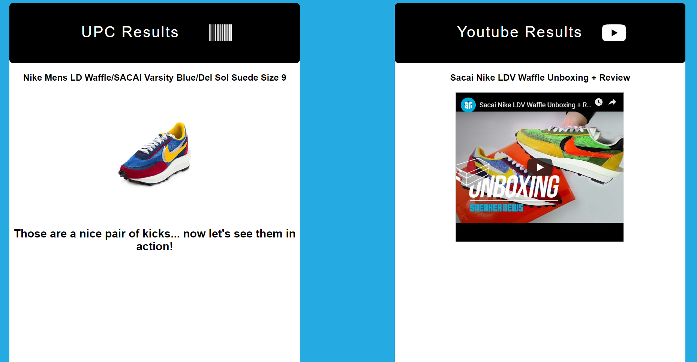

# Polar Chefs Upc-Finder
API Capstone for thinkful 
I made this web application for a group called Polar Chefs, it helps members find sneaker bargains at retail shops.

Live demo https://joalvaca.github.io/UPC-Bargin-Hunter/

Screenshots

Here are some example UPC Codes for you to try on the website, Since the Barcode API isn't just for Sneakers. 
<ul>
<li>884499157670</li>
<li>191040706868</li>
<li>193150591471</li>
<li>191526370798</li>
<li>192502554034</li>
</ul>

This website uses the following computer langauges
<ul>
  <li>HTML</li>
  <li>CSS</li>
  <li>JavaScript</li>
  <li>jQuery</li>
</ul>  

